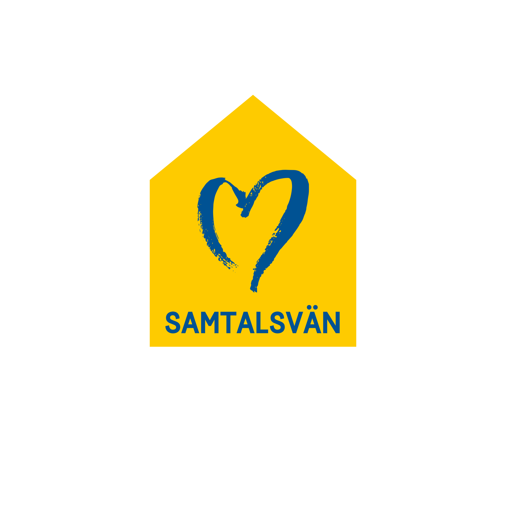
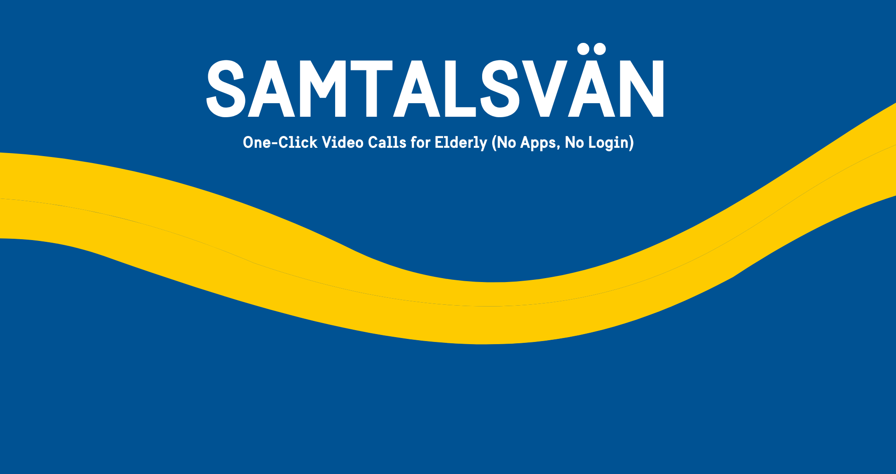

<p align="center">
  
</p>

<h1 align="center">Samtalsvän — One-Click Video Calls for Elderly (No Apps, No Login)</h1>

<p align="center">
  
</p>

[](https://opensource.org/licenses/MIT)
[](CONTRIBUTING.md)
[](https://nodejs.org/)
[](https://webrtc.org/)
[](https://www.docker.com/)
[](https://github.com/AbdirahmanNomad/samtalsvan/issues)
[](https://github.com/AbdirahmanNomad/samtalsvan/stargazers)
[](https://github.com/eller/badges)

*A simple, accessible WebRTC video call application designed for elderly users.*

*En enkel, tillgänglig WebRTC-videosamtalsapplikation designad för äldre användare.*

---

## 🙏 Why This Project Exists

I'm a Swedish citizen, originally from Somalia. I wanted to give something back to the country that welcomed me. Sweden has a growing elderly population, and many seniors feel isolated – especially when technology becomes a barrier. Existing video tools often require accounts, downloads, or confusing steps.

**Samtalsvän** (Swedish for "Conversation Friend") is my small contribution: a tool that turns a video call into a one-click experience. A family member or volunteer creates a call, prints a QR code, and the elderly person simply scans it – that's it. No login, no password, no frustration.

If this tool helps even one person connect with a loved one, it was worth building.

---

## ✨ Features

### 🇬🇧 English
- 🔓 **No login required** – Just start a call and share the link
- 📱 **QR code sharing** – Easy sharing for mobile users
- 👴 **Elderly-initiated calls** – Create contact cards for seniors to call you
- 🎴 **Printable contact cards** – Large, clear print with high contrast
- 📋 **Multiple contacts** – Manage and save multiple contact cards
- 🎨 **Swedish design** – Yellow and blue color scheme for accessibility
- 📞 **Ringtone** – Audio notification for incoming calls
- 🔒 **Privacy-focused** – No data collection, all video peer-to-peer

#### Video Call Controls
- 🎤 **Mute/Unmute** – Toggle microphone on/off
- 📷 **Camera on/off** – Toggle camera with black screen when off
- 🔄 **Camera switch** – Switch between front/back cameras (mobile)
- ⏱️ **Call timer** – Shows elapsed call time
- 📶 **Network indicator** – Shows connection quality (Excellent/Good/Weak)
- 🔊 **Speaker toggle** – Switch between earpiece and speaker
- 🖥️ **Fullscreen mode** – Expand video to full screen

#### Communication Features
- 💬 **Text chat** – Send text messages during calls
- 📸 **Photo sharing** – Share photos during calls (up to 5MB)
- 🎙️ **Voice messages** – Record and send voice messages (up to 1 minute)
- 📅 **Call scheduling** – Schedule future calls with contacts

#### System Features
- 🔄 **Auto-reconnect** – Automatically reconnects if connection drops
- 📋 **Contact management** – View, print, and delete saved contacts
- ⏰ **Date/Time widget** – Displays current time and date (Swedish & English)
- 💾 **Local storage** – Contacts and schedules saved in browser

### 🇸🇪 Svenska
- 🔓 **Ingen inloggning krävs** – Starta bara ett samtal och dela länken
- 📱 **QR-kodsdelning** – Enkel delning för mobilanvändare
- 👴 **Äldre kan ringa** – Skapa kontaktkort för äldre att ringa dig
- 🎴 **Utskrivbara kontaktkort** – Stor, tydlig print med hög kontrast
- 📋 **Flera kontakter** – Hantera och spara flera kontaktkort
- 🎨 **Svensk design** – Gul och blå färgschema för tillgänglighet
- 📞 **Ringsignal** – Ljudnotis vid inkommande samtal
- 🔒 **Integritetsfokus** – Ingen datainsamling, all video peer-to-peer

---

## 🚀 Getting Started

### Prerequisites

- Node.js 18+
- npm or yarn

### Quick Start (Local Development)

```bash
# Clone the repository
git clone https://github.com/AbdirahmanNomad/samtalsvan.git
cd samtalsvan

# Install dependencies
npm install

# Copy environment variables (optional for development)
cp .env.example .env

# Start the server
npm start
```

The app will be available at `http://localhost:3000`

---

## 🔧 Configuration

### Environment Variables

| Variable | Description | Default |
|----------|-------------|---------|
| `PORT` | Server port | `3000` |
| `NODE_ENV` | Environment (development/production) | `development` |
| `BASE_URL` | Public URL for QR codes | `http://localhost:3000` |
| `CORS_ORIGIN` | Allowed origins (comma-separated) | `*` |

### TURN Server Configuration (for NAT traversal)

For production, you need TURN servers for calls to work behind firewalls/NAT:

| Variable | Description |
|----------|-------------|
| `OPENRELAY_ENABLED` | Set to `true` to enable OpenRelay TURN |
| `OPENRELAY_API_KEY` | Your OpenRelay API key (free at metered.ca/openrelay) |
| `TURN_SERVERS` | Custom TURN servers (format: `turn:server:port\|username\|credential`) |
| `TURN_USERNAME` | Default TURN username |
| `TURN_CREDENTIAL` | Default TURN credential |

---

## 📖 How to Use

### Starting a Video Call

1. Open the app in your browser
2. Click **"Starta videosamtal"** (Start video call)
3. Share the link or QR code with the other person
4. They scan/click and the call begins!

### Creating a Contact Card (for Elderly)

1. Click **"Skapa kontaktkort"** (Create contact card)
2. Enter a name (optional)
3. Click **"Skapa kontaktkort"** to generate
4. **Print the card** and give it to your elderly relative
5. Keep your browser open on the "Wait for calls" page
6. When they scan the QR code, you'll receive an incoming call!

### Managing Contacts

1. Click **"Mina kontakter"** (My contacts) on the start screen
2. View all saved contact cards
3. Print any contact card again
4. Delete contacts you no longer need

### During a Call

- **Mute/Unmute**: Click the microphone icon
- **Camera on/off**: Click the camera icon
- **Switch camera**: Click the switch icon (mobile only)
- **Fullscreen**: Click the fullscreen icon
- **Chat**: Click the chat icon to open the chat panel

---

## 🏗️ Architecture

```
┌─────────────────────────────────────────────────────────────┐
│                        Frontend                             │
│  ┌─────────────┐  ┌─────────────┐  ┌─────────────┐        │
│  │  index.html │  │   call.js   │  │  style.css  │        │
│  └─────────────┘  └─────────────┘  └─────────────┘        │
└─────────────────────────────────────────────────────────────┘
                          │
                          │ Socket.io
                          ▼
┌─────────────────────────────────────────────────────────────┐
│                        Backend                              │
│  ┌─────────────┐  ┌─────────────┐  ┌─────────────┐        │
│  │  server.js  │  │  Socket.io  │  │   QRCode    │        │
│  └─────────────┘  └─────────────┘  └─────────────┘        │
└─────────────────────────────────────────────────────────────┘
                          │
                          │ WebRTC
                          ▼
┌─────────────────────────────────────────────────────────────┐
│                      Peer-to-Peer                           │
│              Direct video/audio between browsers            │
└─────────────────────────────────────────────────────────────┘
```

---

## 📁 Project Structure

```
samtalsvan/
├── server.js              # Express + Socket.io server
├── config.js              # Configuration module
├── package.json           # Dependencies
├── Dockerfile             # Docker configuration
├── docker-compose.yml     # Docker Compose (development)
├── docker-compose.prod.yml # Docker Compose (production with Caddy)
├── .env.example           # Environment variables template
├── README.md              # This file
├── CONTRIBUTING.md        # Contribution guidelines
├── PRIVACY.md             # Privacy policy
├── LICENSE                # MIT License
├── deploy/                # Deployment configs
│   ├── Caddyfile          # Caddy reverse proxy config
│   └── nginx.conf         # Nginx reverse proxy config
├── scripts/               # Utility scripts
│   ├── backup.sh          # Database backup script
│   └── restore.sh         # Database restore script
├── .github/               # GitHub Actions
│   └── workflows/
│       └── ci.yml         # CI/CD pipeline
└── public/
    ├── index.html         # Main HTML
    ├── call.js            # WebRTC logic
    ├── style.css          # Styles
    ├── adapter.js         # WebRTC adapter (local)
    ├── favicon.ico        # App icon
    └── fonts/             # Sweden Sans fonts
```

---

## 🔧 API Endpoints

| Method | Endpoint | Description |
|--------|----------|-------------|
| `POST` | `/create-call` | Create a new video call room |
| `POST` | `/create-contact` | Create a contact card for elderly |
| `GET` | `/contact/:code` | Get contact info by code |
| `DELETE` | `/contact/:code` | Delete a contact (requires `X-Owner-Token`) |
| `GET` | `/contacts` | Get multiple contacts (query: `codes`) |
| `GET` | `/health` | Health check endpoint |
| `GET` | `/health/ready` | Readiness check |
| `GET` | `/health/live` | Liveness check |
| `GET` | `/ice-servers` | Get ICE server configuration |
| `GET` | `/api/user/data` | Export user data (GDPR, requires `X-Owner-Token`) |
| `DELETE` | `/api/user/data` | Delete user data (GDPR, requires `X-Owner-Token`) |

---

## 🚀 Deployment

### Production Requirements

1. **HTTPS** - Required for WebRTC camera/mic access
2. **TURN Server** - Required for NAT traversal (calls behind firewalls)
3. **Domain name** - For SSL certificate

### Option 1: Docker Compose with Caddy (Recommended)

```bash
# Clone and configure
git clone https://github.com/AbdirahmanNomad/samtalsvan.git
cd samtalsvan

# Create .env file
cp .env.example .env
# Edit .env with your settings:
# - BASE_URL=https://your-domain.com
# - DOMAIN=your-domain.com
# - OPENRELAY_API_KEY=your-key (get free at metered.ca/openrelay)

# Start production stack
docker-compose -f docker-compose.prod.yml up -d
```

### Option 2: Manual Deployment with PM2

```bash
# Install PM2
npm install -g pm2

# Start server
pm2 start server.js --name samtalsvan

# Setup nginx reverse proxy with Let's Encrypt
sudo apt install nginx certbot python3-certbot-nginx
sudo nano /etc/nginx/sites-available/samtalsvan
# Configure reverse proxy to localhost:3000

# Get SSL certificate
sudo certbot --nginx -d your-domain.com
```

---

## 🔒 Security Features

### Input Validation
- **Joi schemas** for all user inputs
- **XSS protection** with output escaping
- **Rate limiting** on all endpoints

### Authentication & Authorization
- **Token-based authorization** for contact deletion
- **Socket.io room isolation**

### Security Headers (Helmet)
- Content Security Policy (CSP)
- HTTP Strict Transport Security (HSTS)
- X-Content-Type-Options: nosniff
- X-Frame-Options: DENY

### Rate Limiting
- 10 requests/minute for call creation
- 20 requests/minute for contact operations
- 5 requests/minute for GDPR endpoints

### GDPR Compliance
- `GET /api/user/data` - Export all user data
- `DELETE /api/user/data` - Delete all user data

---

## 🤝 Contributing

We welcome contributions! See [CONTRIBUTING.md](CONTRIBUTING.md) for details.

---

## 📄 License

MIT – free to use, modify, and share. See [LICENSE](LICENSE).

---

## 🔒 Privacy

We don't collect any personal data. Video calls are peer-to-peer and never touch our servers. See [PRIVACY.md](PRIVACY.md) for details.

---

## 👤 Author

**Abdirahman Ahmed**
📧 hello@abdirahman.net

---

Built with ❤️ for Sweden, and for every generation that deserves to stay connected.

*Byggt med ❤️ för Sverige, och för varje generation som förtjän att hålla kontakten.*
